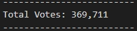
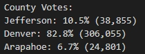
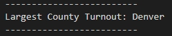
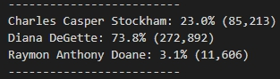
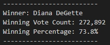
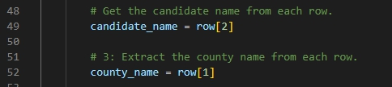
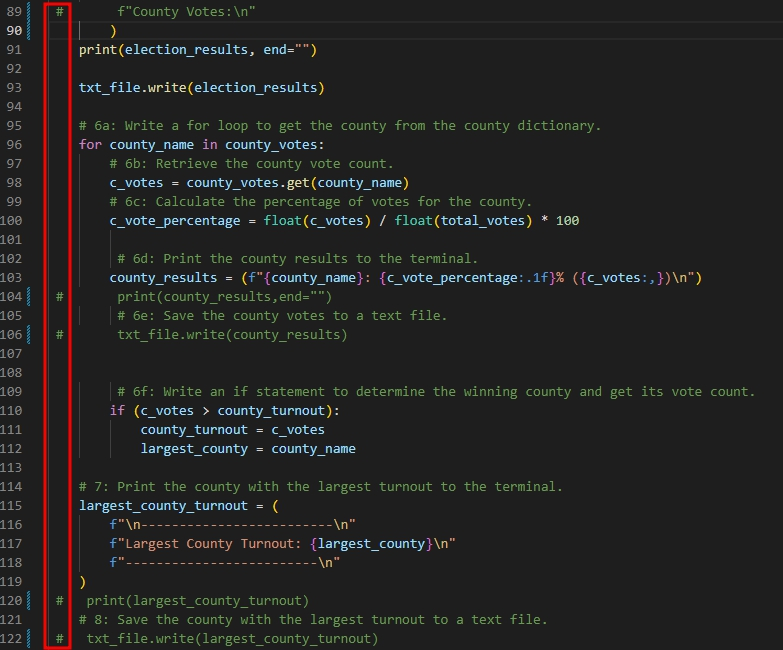
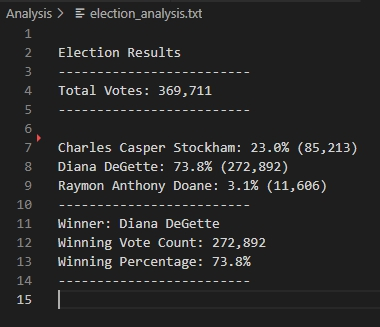

# Election Analysis

## Project Overview
Colorado Board of Elections, in addition to analyses on candidates' votes, would like to further gain information on the participating counties' vote status. More specifically:

1. Vote turnout for each participating county.
2. Calculate the percentage of votes per county against total number of votes. 
3. Determine which county had highest number of votes.

## Resources
- Data Source: election_results.csv
- Software: Python 3.7.7, Visual Studio Code 1.73.1

## Election Audit Results
The results of the election shows the following: 

- Total number of votes in the congressional election: 
    - 369,711 <br>
    
        

- The participating counties were: 

    - Jefferson with 38,855 number of votes, or 10.5% of the total votes.
    - Denver with 306,055 number of votes, or 82.8% of the total votes.
    - Arapahoe with 24,801 number of votes, or 6.7% of the total votes. <br>

        

- The county with largest number of votes:

    - Denver, with 306,055 number of votes, or 82.8% of the total votes. <br>

        

- The voting results on cadidates were:

    - Charles Casper Stockham received 85,213 number of votes, or 23.0% of total votes
    - Diana DeGette received 272,892 number of votes, or 73.8% of total votes
    - Raymon Anthony Doane received 11,606 number of votes, or 3.1% of total votes<br>

        

- The winner of the election by popular vote was:  

    - Diana DeGette, with 272,892 number of votes, or 73.8% of total votes.<br>

      

## Election-Audit Summary

The script used on this congressional election can be used to analyze any election with some modifications. If the data in csv file differs from currently used election file, then user can modify, or re-specify, below small block of code to the corresponding column. 



Based on the current csv, candidate's name was listed in third column, and county name was listed in second column. But if the new file, for example, had candidate's name in second and county's name in third, user can simply change the numbers in `row[]` as shown below to re-map the candidate name column to second and county name to third column.
``` 
candidate_name = row[1]
county_name = row[2] 
```

<br>
Another possible modification is to edit out any undesired `print` codes by adding `#` in front of the code to "skip" the designated line of code. For example, if the user only wants to see the candidate results, `c` can be added as shown: <br>



The addition of `#` will skip in printing the county vote results, showing only candidate results. 



